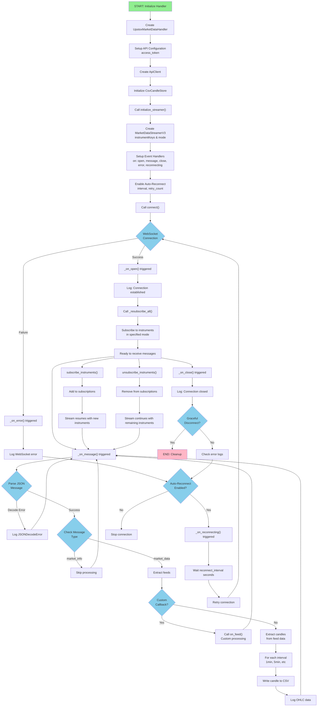
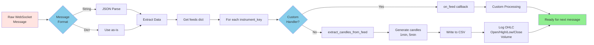
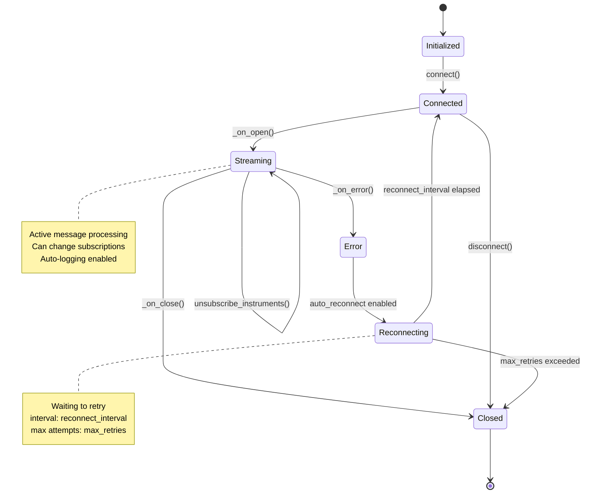
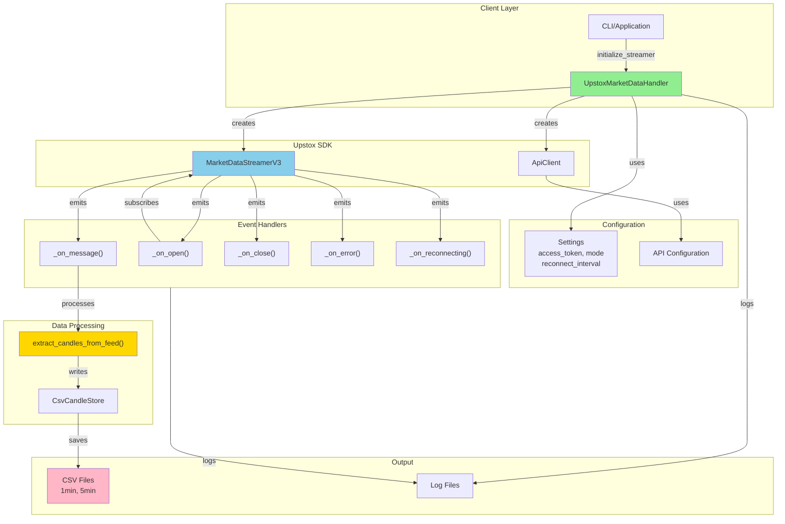

# Upstox WebSocket Architecture Flowchart

## Complete WebSocket Flow



## Message Processing Pipeline



## State Transitions



## Component Interaction



---

## Key Methods Reference

| Method | Purpose | Parameters |
|--------|---------|-----------|
| `initialize_streamer()` | Setup streamer with instruments | `instruments: list[str]`, `mode: str` |
| `connect()` | Establish WebSocket connection | None |
| `disconnect()` | Close WebSocket connection | None |
| `enable_auto_reconnect()` | Configure reconnection behavior | `enabled, interval, retry_count` |
| `subscribe_instruments()` | Add new instruments to stream | `instruments: list[str]`, `mode: str` |
| `unsubscribe_instruments()` | Remove instruments from stream | `instruments: list[str]` |
| `set_subscriptions()` | Replace entire subscription list | `instruments: list[str]`, `mode: str` |

## Error Handling Flow

```
Error Occurs
    ↓
_on_error() callback
    ↓
Log error message
    ↓
Check: auto_reconnect enabled?
    ├─ YES → _on_reconnecting()
    │        ↓
    │        Wait reconnect_interval seconds
    │        ↓
    │        Retry connection
    │        ↓
    │        Check: retry_count < max_retries?
    │        ├─ YES → Attempt reconnect
    │        └─ NO → Stop
    │
    └─ NO → Stop connection
```

